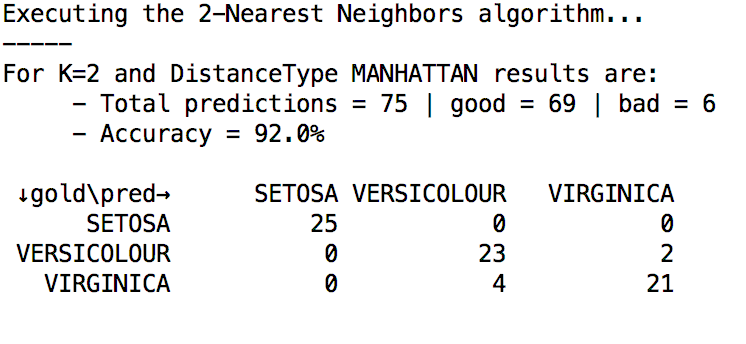

# Machine Learning KNN 

Java implementation of the K-nearest neighbor classifier

## k-nearest neighbors algorithm
In pattern recognition, the k-Nearest Neighbors algorithm (or k-NN for short) is a non-parametric method used for classification. 
The input consists of the k closest (depends of the considered distance) training examples in the feature space.
The output is a class membership. An object is classified by a majority vote of its neighbors, with the object being assigned to the class most common among its k nearest neighbors (k is a positive integer, typically small). If k = 1, then the object is simply assigned to the class of that single nearest neighbor.

## How to run ?
Sipmply execute the ```main``` method in the ```Launcher``` class and play with the parameters.
You may have to download dependencies using ```mvn clean install```

## Demo


